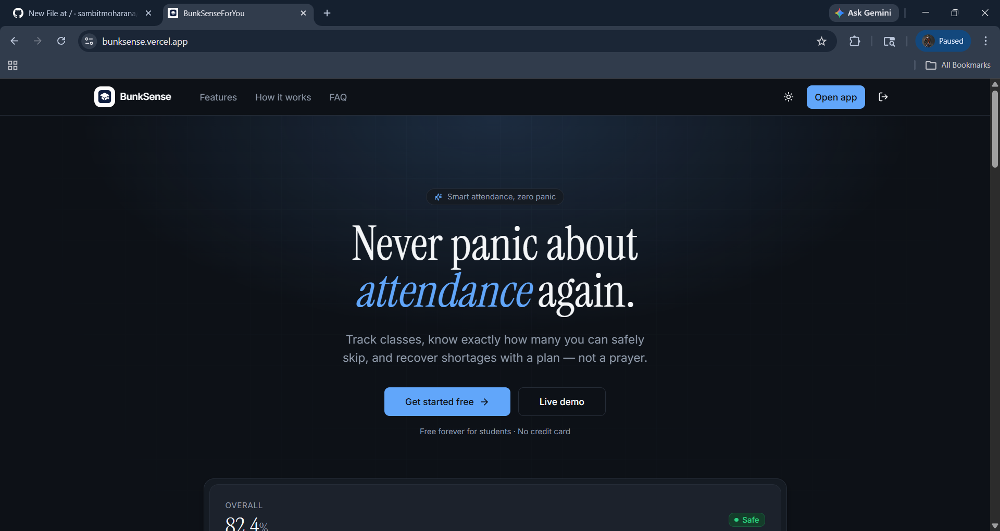
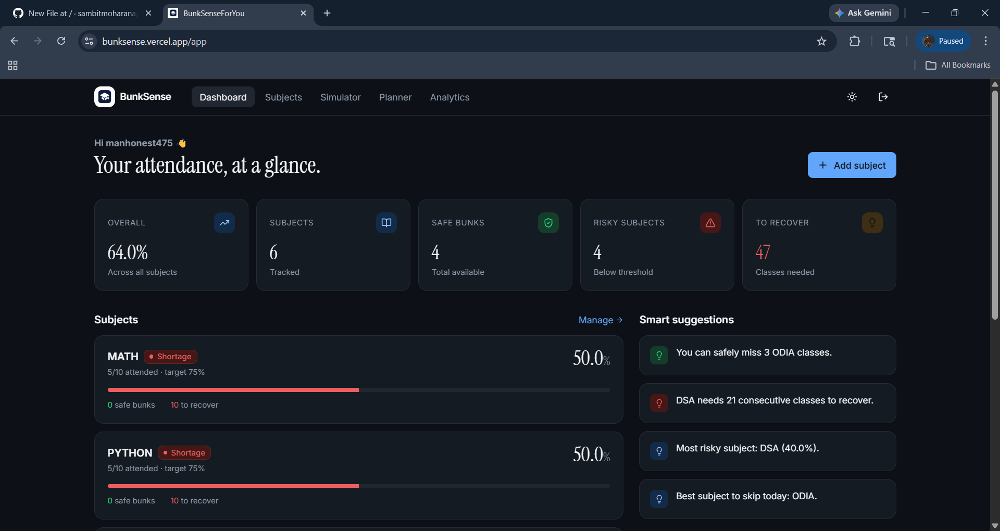
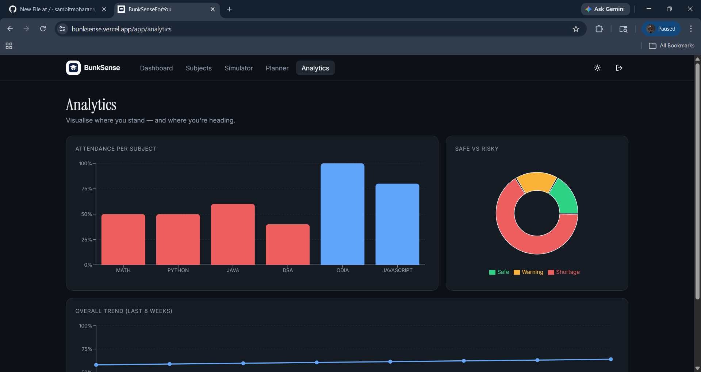

# 🎓 BunkSense

> "I stopped tracking attendance in spreadsheets. BunkSense just tells me." 

BunkSense is a modern, fast, and secure student attendance tracking application. Designed to replace tedious spreadsheets, BunkSense makes it effortless for students to monitor their class attendance, calculate percentages, and plan their bunks perfectly! 🚀

## ✨ Features

- 🔐 **Secure Authentication:** Passwordless Google OAuth and secure Email/Password login powered by Supabase.
- 📊 **Smart Analytics:** Real-time attendance calculations and beautiful visual charts to track your progress.
- 📱 **Fully Responsive:** Looks and works perfectly on desktop, tablet, and mobile devices.
- ⚡ **Lightning Fast:** Built with modern web technologies for a snappy, instantaneous user experience.

## 🛠️ Tech Stack & Tools Used

BunkSense is built entirely using a modern frontend stack with a robust backend-as-a-service.

### Frontend
- ⚛️ **React** - UI library (v18)
- ⚡ **Vite** - Lightning-fast build tool and development server
- 📘 **TypeScript** - For type-safe and reliable code
- 🎨 **Tailwind CSS** - Utility-first CSS framework for beautiful styling
- 🧱 **shadcn/ui & Radix UI** - Accessible, unstyled, and customizable UI components
- 📈 **Recharts** - For beautiful, responsive charts and analytics
- 📝 **React Hook Form & Zod** - Form handling and schema validation
- 🔔 **Sonner** - Toast notifications
- 📅 **date-fns** - Modern JavaScript date utility library
- 🗺️ **React Router** - Client-side routing

### Backend & Deployment
- 🟢 **Supabase** - Authentication & Database
- ▲ **Vercel** - Cloud platform for frictionless deployment

## ⚙️ How It Works

1. **Add Subjects:** Enter your classes and minimum required attendance percentage.
2. **Track Daily:** Mark yourself as Present, Absent, or Class Cancelled with a single click.
3. **Analyze:** The dashboard automatically calculates your overall attendance and warns you if you drop below your target.
4. **Plan Bunks:** Use the built-in simulator to see exactly how many upcoming classes you can afford to miss safely!

## 🚀 Installation Process

If you want to view the UI and layout locally:

1. **Clone the repository:**
   ```bash
   git clone https://github.com/sambitmoharana/bunksense_makessense.git
   cd bunksense_makessense
   ```

2. **Install dependencies:**
   ```bash
   npm install
   ```

3. **Run the development server:**
   ```bash
   npm run dev
   ```

*(Note: Certain features like database syncing and authentication are securely locked behind private environment variables and will not function without the original backend configuration.)*

## 🔮 Future Improvements

- [ ] Support for timetable integration and automatic subject scheduling.
- [ ] Push notifications to remind users to update their daily attendance.
- [ ] Advanced dark mode customization and theming.
- [ ] Multi-semester tracking and historical GPA correlation.

## 🔗 Live Demo

Check out the live application here:  
**[https://bunksense.vercel.app](https://bunksense.vercel.app)**

## 📸 Screenshots

### Home Page


### Dashboard


### Analytics


## 👨‍💻 Author

Created by **Sambit Moharana**
